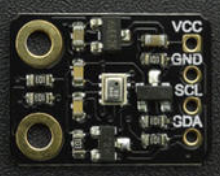

# BMP280

* [中文版](./README_CN.md)

DFRobot's Temperature, Pressure and Approx altitude.



## Product Link（[https://www.dfrobot.com/product-2140.html](https://www.dfrobot.com/product-2140.html)）
    SKU: SEN0372

* [Summary](#summary)
* [Installation](#installation)
* [Methods](#methods)
* [Compatibility](#compatibility)
* [History](#history)
* [Credits](#credits)

## Summary
Provides an Arduino library for reading and interpreting Bosch BMP280 data over I2C. <br>
Used to read current temperature, air pressure and calculate altitude.

## Installation

To use this library download the zip file, uncompress it to a folder named DFRobot_BMP280. 
Download the zip file first to use this library and uncompress it to a folder named DFRobot_BMP280. 

## Methods

```C++
  /**
   * @fn begin
   * @brief begin Sensor begin
   * @return Enum of eStatus_t
   */
  eStatus_t begin();

  /**
   * @fn getTemperature
   * @brief getTemperature Get temperature
   * @return Temprature in Celsius
   */
  float  getTemperature();

  /**
   * @fn getPressure
   * @brief getPressure Get pressure
   * @return Pressure in pa
   */
  uint32_t getPressure();

  /**
   * @fn calAltitude
   * @brief calAltitude Calculate altitude
   * @param seaLevelPressure Sea level pressure
   * @param pressure Pressure in pa
   * @return Altitude in meter
   */
  float calAltitude(float seaLevelPressure, uint32_t pressure);

  /**
   * @fn reset
   * @brief reset Reset sensor
   */
  void reset();

  /**
   * @fn setCtrlMeasMode
   * @brief setCtrlMeasMode Set control measure mode
   * @param eMode One enum of eCtrlMeasMode_t
   */
  void setCtrlMeasMode(eCtrlMeasMode_t eMode);

  /**
   * @fn setCtrlMeasSamplingTemp
   * @brief setCtrlMeasSamplingTemp Set control measure temperature oversampling
   * @param eSampling One enum of eSampling_t
   */
  void setCtrlMeasSamplingTemp(eSampling_t eSampling);

  /**
   * @fn setCtrlMeasSamplingPress
   * @brief setCtrlMeasSamplingPress Set control measure pressure oversampling
   * @param eSampling One enum of eSampling_t
   */
  void setCtrlMeasSamplingPress(eSampling_t eSampling);

  /**
   * @fn setConfigFilter
   * @brief setConfigFilter Set config filter
   * @param eFilter One enum of eConfigFilter_t
   */
  void setConfigFilter(eConfigFilter_t eFilter);

  /**
   * @fn setConfigTStandby
   * @brief setConfigTStandby Set config standby time
   * @param eT One enum of eConfigTStandby_t
   */
  void setConfigTStandby(eConfigTStandby_t eT);

  /**
   * @fn DFRobot_BMP280_IIC
   * @brief DFRobot_BMP280_IIC
   * @param pWire Which TwoWire peripheral to operate
   * @param eSdo Pin sdo status
   * @n     eSdoLow,
   * @n eSdoHigh
   */
  DFRobot_BMP280_IIC(TwoWire *pWire, eSdo_t eSdo);

```

## Compatibility

MCU                | Work Well | Work Wrong | Untested  | Remarks
------------------ | :----------: | :----------: | :---------: | -----
FireBeetle-ESP32  |      √       |             |            | 
FireBeetle-ESP8266  |      √       |             |            | 
Arduino uno |       √      |             |            | 

## History

- 2018/11/31 - Version 1.0.0 released.
- 2019/03/12 - Version 1.0.1 released.

## Credits

Written by Frank(jiehan.guo@dfrobot.com), 2018. (Welcome to our [website](https://www.dfrobot.com/))
