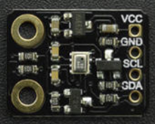

# DFRobot_DHT11

* [English Version](./README.md)

测量环境的温度、压力和大约高度.




## 产品链接（[https://www.dfrobot.com.cn/goods-2950.html](https://www.dfrobot.com.cn/goods-2950.html)）
    SKU: SEN0372
   
## 目录

* [概述](#概述)
* [库安装](#库安装)
* [方法](#方法)
* [兼容性](#兼容性)
* [历史](#历史)
* [创作者](#创作者)

## 概述

提供 Arduino 库，用于通过 I2C 读取和解释 Bosch BMP280 数据。 <br>
用于读取当前温度、气压和计算高度。

## 库安装

使用此库前，请首先下载库文件，将其粘贴到\Arduino\libraries目录中，然后打开examples文件夹并在该文件夹中运行演示。

## 方法

```C++
    /**
   * @fn begin
   * @brief 传感器初始化
   * @return 初始化状态
   */
  eStatus_t begin();

  /**
   * @fn getTemperature
   * @brief 获取温度
   * @return 摄氏度温度
   */
  float  getTemperature();

  /**
   * @fn getPressure
   * @brief 获取压强
   * @return 压强，单位pa
   */
  uint32_t getPressure();

  /**
   * @fn calAltitude
   * @brief 计算海拔
   * @param seaLevelPressure 海平面压力
   * @param pressure 压强，单位：pa
   * @return 海拔高度，单位：米(m)
   */
  float calAltitude(float seaLevelPressure, uint32_t pressure);

  /**
   * @fn reset
   * @brief 复位传感器
   */
  void reset();

  /**
   * @fn setCtrlMeasMode
   * @brief 设置控制测量模式
   * @param eMode eCtrlMeasMode_t枚举变量
   */
  void setCtrlMeasMode(eCtrlMeasMode_t eMode);

  /**
   * @fn setCtrlMeasSamplingTemp
   * @brief 设置温度采样率
   * @param eSampling eSampling_t枚举变量
   */
  void setCtrlMeasSamplingTemp(eSampling_t eSampling);

  /**
   * @fn setCtrlMeasSamplingPress
   * @brief 设置压强采样率
   * @param eSampling eSampling_t枚举变量
   */
  void setCtrlMeasSamplingPress(eSampling_t eSampling);

  /**
   * @fn setConfigFilter
   * @brief 配置过滤参数
   * @param eFilter eConfigFilter_t枚举变量
   */
  void setConfigFilter(eConfigFilter_t eFilter);

  /**
   * @fn setConfigTStandby
   * @brief 设置配置待机时间
   * @param eT eConfigTStandby_t枚举变量
   */
  void setConfigTStandby(eConfigTStandby_t eT);

  /**
   * @fn DFRobot_BMP280_IIC
   * @brief DFRobot_BMP280_IIC
   * @param pWire TwoWire类对象指针
   * @param eSdo eSdo_t枚举变量
   */
  DFRobot_BMP280_IIC(TwoWire *pWire, eSdo_t eSdo);
```

## 兼容性

MCU                | Work Well | Work Wrong | Untested  | Remarks
------------------ | :----------: | :----------: | :---------: | -----
FireBeetle-ESP32  |      √       |             |            | 
FireBeetle-ESP8266  |      √       |             |            | 
Arduino uno |       √      |             |            | 

## 历史
- 2018/11/31 - 1.0.0 版本
- 2019/03/12 - 1.0.1 版本

## 创作者

Written by Frank(jiehan.guo@dfrobot.com), 2018. (Welcome to our [website](https://www.dfrobot.com/))


