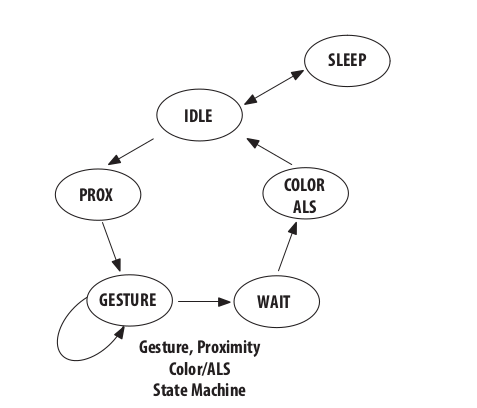

# Melopero_APDS-9960_Arduino_Library

## Install

Through the arduino library manager.

## Introduction 

The sensor is made up of four different 'engines':

- Proximity Engine

- Gesture Engine

- Color/Als Engine

- Wait Engine

The sensor works like a state machine where each engine represents a state. There are also the SLEEP and IDLE state.  
The states are entered sequentially in the order depicted below:



## How to use

Including the library and device object creation:

```C++
#include "Melopero_APDS9960.h"
#include "Wire.h"

Melopero_APDS9960 device;

void setup() {
    ...

    // Initialize the comunication library
    Wire.begin();
    device.initI2C(); // device.initI2C(i2c_address, i2c_bus);
    // the default are i2c_address=0x39 and i2c_bus=Wire
    // use device.initI2C(0x39, Wire1); to use Wire1 instead

    device.reset(); // Reset all interrupt settings and power off the device
    ...
```

Enabling/Disabling the engines:

```C++
device.enableProximityEngine(true); // false to disable
device.enableAlsEngine(true); // false to disable
device.enableGestureEngine(true); // false to disable
device.enableWaitEngine(true); // false to disable
```

### Error detection

Each method/function returns a status code (int8_t). You can check the status code to see if any errors occurred. 

```C++
    ...
    int8_t status = NO_ERROR; // 0
    status = device.enableProximityEngine();
    checkError(status);
    ...

void checkError(int8_t status_code){
    if (error_code == NO_ERROR)
        Serial.println("No error :)");
    else if (error_code == I2C_ERROR)
        Serial.println("I2C comunication error :(");
    else if (error_code == INVALID_ARGUMENT)
        Serial.println("Invalid argument error :(");
    else 
        Serial.println("Unknown error O.O");
}
```

### General Device Methods

To toggle between the low consumption SLEEP state and the operating IDLE state:  

```C++
device.wakeUp(true); // Enter IDLE state
device.wakeUp(false); // Enter SLEEP state
```

Other general methods:  

```C++
device.setSleepAfterInterrupt(true);
// Enters SLEEP state after an interrupt occurred
// Very useful when dealing with gesture fifo interrupts
// for a detailed explanation see the gesture interrupts 
// example.

device.setLedDrive(led_drive);
// Sets the LED drive strength. Must be one of LED_DRIVE_N_mA

device.setLedBoost(led_boost);
// The LED_BOOST allows the LDR pin to sink more current above the maximum settings. Must be
// one of LED_BOOST_N (where N is the percentage).

device.updateStatus();
// updates the status variable (uint8_t) that contains status information
```

### Proximity engine

To read the last measured proximity value (to update the proximity values the engine must be enabled):

```C++
device.updateProximityData();
// updates the value in device.proximityData
Serial.println(device.proximityData);
```

#### Proximity interrupts

```C++
device.enableProximityInterrupts(true); // false to disable

device.clearProximityInterrupts();

device.setProximityInterruptThresholds(uint8_t low, uint8_t high);
// The Proximity Interrupt Threshold sets the high and low trigger points for the comparison
// function which generates an interrupt. If the value generated by the proximity channel,
// crosses below the lower threshold or above the higher threshold, an interrupt may be
// signaled to the host processor.

device.setProximityInterruptPersistence(uint8_t persistence);
// The Interrupt Persistence sets a value which is compared with the accumulated amount
// Proximity cycles in which results were outside threshold values. Any Proximity result
// that is inside threshold values resets the count.
```

#### Advanced settings

```C++
device.setProximityGain(prox_gain);
// prox_gain must be one of PROXIMITY_GAIN_NX

device.setProximityPulseCountAndLength(uint8_t pulse_count, pulse_length);
// The proximity pulse count is the number of pulses to be output on the LDR pin. The proximity
// pulse length is the amount of time the LDR pin is sinking current during a proximity pulse.
// pulse_count must be in range [1-64] and pulse_length must be one of PULSE_LEN_N_MICROS
```

### Gesture engine

The sensor enters the gesture engine state only if the proximity measurement is over a certain threshold.

```C++
device.setGestureProxEnterThreshold(uint8_t enter_thr); // Sets the enter threshold

device.setGestureExitThreshold(uint8_t exit_thr); // Sets the exit threshold

device.setGestureExitPersistence(persistence);
// Sets number of consecutive measurements that have to be below the exit threshold
// to exit the gesture state.  
// Must be one of EXIT_AFTER_N_GESTURE_END

device.setGestureExitMask(bool mask_up, bool mask_down, bool mask_left, bool mask_right);
// Controls which of the gesture detector photodiodes (UDLR) will be included to
// determine a “gesture end” and subsequent exit of the gesture state machine

// This methods are NOT meant to be called every measurement... they are called just
// once to set the gesture engine state enter and exit condition

// To make sure the gesture engine state is always entered you can set both thresholds to 0
device.setGestureProxEnterThreshold(0);
device.setGestureExitThreshold(0);
```

The gesture data is made of datasets of four bytes that represent the values of the UDLR photodiodes.
The gesture data is stored in a FIFO queue and can be retrieved with the following methods:  

```C++
device.updateNumberOfDatasetsInFifo();

for (int i = 0; i < device.datasetsInFifo; i++){
    device.updateGestureData(); // Reads the first dataset in the queue
    Serial.print(device.gestureData[0]);
    Serial.print(device.gestureData[1]);
    Serial.print(device.gestureData[2]);
    Serial.println(device.gestureData[3]);
}
```

To detect/parse gesture there are two useful methods:

```C++
// Collect gesture data and try to detect a gesture for the given amount of time
device.parseGesture(uint parse_millis, uint8_t tolerance = 12, uint8_t der_tolerance = 6, uint8_t confidence = 6);
// Try to detect a gesture from the datasets present in the fifo
device.parseGestureInFifo(uint8_t tolerance = 12, uint8_t der_tolerance = 6, uint8_t confidence = 6);

// The detected gestures are stored in:
device.parsedUpDownGesture // vertical axis gesture, can be one of: NO_GESTURE, UP_GESTURE, DOWN_GESTURE
device.parsedLeftRightGesture // horizontal axis gesture can be one of: NO_GESTURE, LEFT_GESTURE, RIGHT_GESTURE

// Advanced settings:
// The tolerance parameter determines how much the two values (on the same axis) have to differ to interpret
// the current dataset as valid for gesture detection (if the values are nearly the same then its not possible to decide the direction 
// in which the object is moving).
//
// The der_tolerance does the same for the derivative of the two curves (the values on one axis through time):
// this prevents the device from detecting a gesture if the objects surface is not even...
//
// The confidence tells us the minimum amount of "detected gesture samples" needed for an axis to tell that a gesture has been detected othat axis:
// How its used in the source code: if (detected_up_gesture_samples > detected_down_gesture_samples + confidence) gesture_up_down = GESTURE_UP
```

Other general methods:

```C++
device.checkGestureEngineRunning();
if (device.gestureEngineRunning){
    ...
}

device.updateGestureStatus();
// updates an uint8_t containing data about the gesture engine status
Serial.println(device.deviceStatus, BIN);
```

#### Gesture interrupts

```C++
device.enableGestureInterrupts();

device.setGestureFifoThreshold(fifo_thr);
// if the number of datasets in the FIFO exceeds the given threshold an interrupt is generated.
// Must be one of FIFO_INT_AFTER_N_DATASETS

device.resetGestureEngineInterruptSettings();
```

#### Advanced settings

There are several other methods (similar to the proximity engine) to tweak the gesture engine's settings.

### Color/Als engine

To read the last measured color value (to update the color values the engine must be enabled):

```C++
device.updateColorData();
// upèdates the last measured ARGB values (Alfa Red Green Blue) ( 16 bit unisgned integers)
Serial.println(device.red);
Serial.println(device.green);
Serial.println(device.blue);
Serial.println(device.clear);
```

The maximum values for the ARGB values depends on the saturation value which depends on the color engine's settings. To normalize the color values :

```C++
// First set the Color engine settigns
// ....
// ....

// Then update the saturation value
device.updateSaturation();

// update raw color data
device.updateColorData(); // the raw data retrieved from the sensor 16 bit uints
// then divide by the color values by the saturation value
float norm_red = (float) device.red / (float) device.alsSaturation;
float norm_green = (float) device.green / (float) device.alsSaturation;
float norm_blue = (float) device.blue / (float) device.alsSaturation;
float norm_clear = (float) device.clear / (float) device.alsSaturation;
```

#### Color/Als interrupts

```C++
device.enableAlsInterrupts();

device.setAlsThresholds(uint16_t low, uint16_t high);
// if clear channel data is less than low or greater than high an interrupt is generated.

device.setAlsInterruptPersistence(uint8_t persistence);
// Sets the number of measurements that meet the interrupt conditions to generate an interrupt.
// persistence value = meaning
// 0 = Every ALS cycle
// 1 = Any ALS value outside of threshold range
// 2 = 2 consecutive ALS values out of range
// 3 = 3 consecutive ALS values out of range
// N > 3 = (N - 3) * 5 consecutive ALS values out of range 

device.clearAlsInterrupts();
```

#### Advanced settings

```C++
device.setAlsGain(als_gain);
// als_gain must be one of ALS_GAIN_NX

device.setAlsIntegrationTime(float wtime);
// the internal integration time of ALS/Color analog to digital converters.
// If in a low light environment a longer integration time may lead to
// better results.
// the integration time must be expressed in milliseconds and must be in range [2.78 - 712]
```

### Wait engine

To set the wait time you can use:

```C++
device.setWaitTime(float wtime, bool long_wait=false);
// This is the time that will pass between two cycles.The wait time should be
// configured before the proximity and the als engines get enabled.
// wtime: the time value in milliseconds. Must be between 2.78ms and 712ms
// long_wait = False: If true the wait time is multiplied by 12.
```
